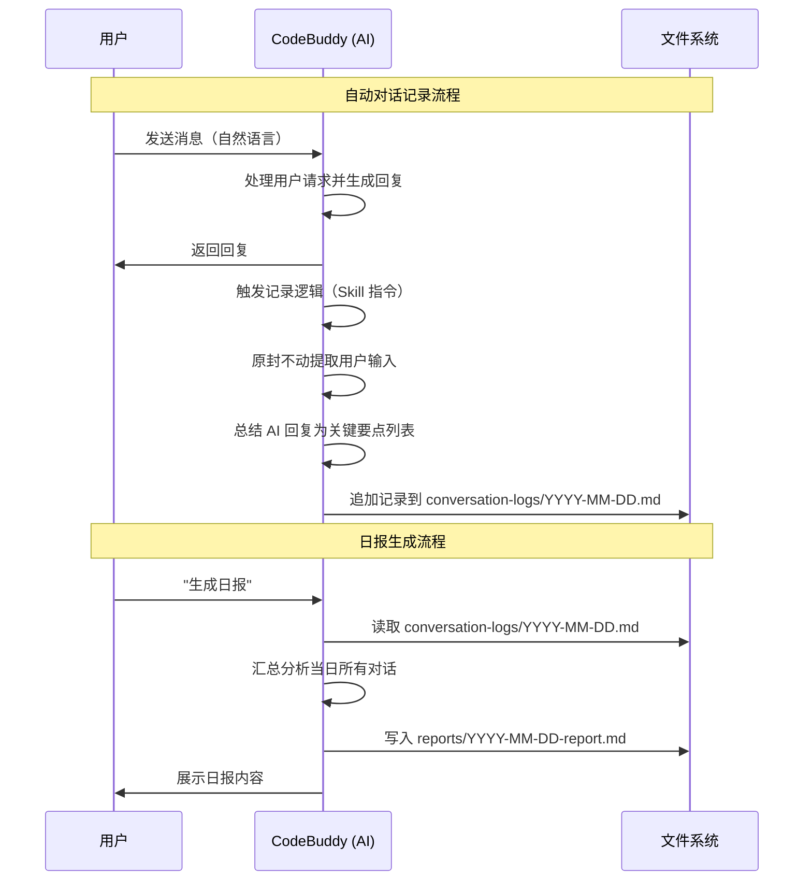

# Proposal: conversation-recorder-skill

> **状态**: draft
> **创建日期**: 2026-04-21
> **变更目录**: `changes/conversation-recorder-skill/`

## 1. 背景

每天需要向领导汇报 OpenSpec 规范在项目中的使用情况，每一条与大模型的对话都需要 review。目前对话内容散落在 CodeBuddy 的会话中，没有持久化记录，回顾和汇报效率低下。

## 2. 目标

创建一个 CodeBuddy Skill，实现：

1. **自动记录对话**：每轮对话自动记录到本地 Markdown 文件
2. **用户输入原封不动保留**：用户的自然语言提问完整记录
3. **AI 反馈关键要点总结**：大模型的回复以关键要点列表形式总结记录
4. **按天组织日志**：每天一个日志文件，同天多次对话追加
5. **手动生成日报**：用户说"生成日报"时，汇总当日所有对话生成结构化日报

## 3. 功能需求清单

### F1: 自动对话记录

- **触发方式**：Skill 加载后，每轮对话自动触发记录
- **记录内容**：
  - 时间戳（精确到分钟）
  - 用户原始输入（原封不动）
  - AI 反馈摘要（关键要点列表）
- **存储位置**：项目目录下 `conversation-logs/YYYY-MM-DD.md`
- **追加模式**：同一天的对话追加到同一文件末尾
- **短消息处理**：所有消息均记录，不过滤

### F2: 日报生成

- **触发方式**：用户手动说"生成日报"
- **触发词**：`生成日报`、`今日总结`、`daily report`、`对话日报`
- **日报内容**：
  - 日期
  - 当日对话总数
  - 每轮对话的摘要（时间 + 用户问题概括 + AI 做了什么）
  - 关键产出汇总（创建/修改了哪些文件、做了哪些决策）
  - 经验与改进建议
- **输出位置**：`conversation-logs/reports/YYYY-MM-DD-report.md`

### F3: 日志文件格式

每日日志文件格式：

```markdown
# 对话记录 - 2026-04-21

## [10:30] 对话 #1

### 用户输入
> （用户原始自然语言，原封不动）

### AI 反馈摘要
- 要点 1：修改了 xxx 文件的 xxx 逻辑
- 要点 2：建议后续补充 xxx
- 要点 3：创建了 xxx 新文件

---

## [11:15] 对话 #2
...
```

日报格式：

```markdown
# 日报 - 2026-04-21

## 概览
- 对话总数：5 轮
- 涉及项目：record-spec

## 对话摘要

| # | 时间 | 用户问题概括 | AI 执行摘要 |
|---|------|-------------|------------|
| 1 | 10:30 | 创建 skill 需求讨论 | 进行需求头脑风暴，细化了 5 个维度 |
| 2 | 11:15 | 确认日志组织方式 | 确定按天维度组织 + 手动生成日报 |

## 关键产出
- 创建文件：conversation-logs/2026-04-21.md
- 修改文件：无
- 关键决策：采用按天维度 + 关键要点列表总结

## 经验与改进建议
- （AI 基于当日对话内容自动总结）
```

## 4. 非功能需求

- **不侵入现有项目**：日志文件存放在独立目录 `conversation-logs/`
- **幂等性**：重复触发不会产生重复记录
- **容错**：目录不存在时自动创建
- **无外部依赖**：纯 Markdown 文件操作，不依赖数据库或网络

## 5. 验收标准

| # | 验收项 | 标准 |
|---|--------|------|
| AC1 | Skill 加载后每轮对话自动记录 | 对话结束后 `conversation-logs/YYYY-MM-DD.md` 文件有新增记录 |
| AC2 | 用户输入原封不动 | 日志中用户输入与实际输入文字完全一致 |
| AC3 | AI 反馈以要点列表总结 | 每条 AI 反馈有 2-5 个要点，概括关键动作和决策 |
| AC4 | 按天组织 | 同一天的对话在同一文件中，跨天自动创建新文件 |
| AC5 | 手动生成日报 | 说"生成日报"后在 `reports/` 目录生成结构化日报 |
| AC6 | 日报格式完整 | 包含概览、对话摘要表、关键产出、经验建议四个章节 |

## 6. 技术方案概要

- **产物类型**：CodeBuddy Project Skill（`.codebuddy/skills/conversation-recorder/`）
- **核心机制**：通过 SKILL.md 指令注入，让 AI 在每轮对话结束时执行记录动作
- **日报生成**：读取当日日志文件，AI 进行汇总分析后输出报告

## 7. UML 时序图


